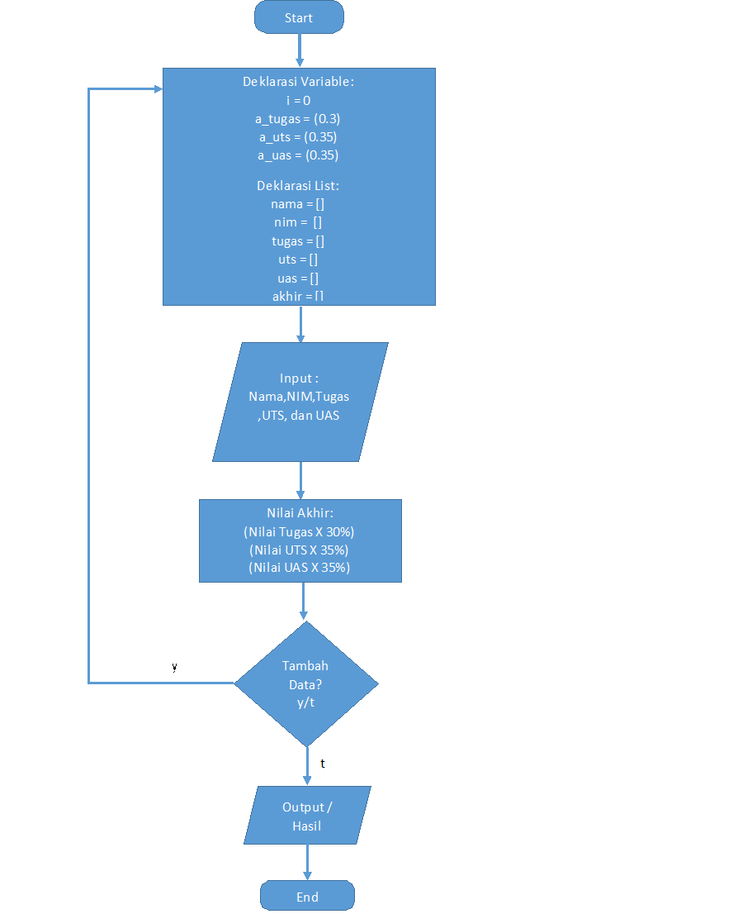

# TUGAS PRAKTIKUM 4 - Pertemuan 9

Nama      : Bangkit Akbar Anggara 
NIM       : 312010148 
Kelas     : TI.20.B.1 

# Tugas

Pada pertemuan ke-9 saya diberi tugas oleh dosen saya untuk membuat program sederhana seperti gambar dibawah ini: 

dan untuk bentuk dari programnya seperti ini: 

Berikut adalah source code yang saya gunakan untuk mengerjakan soal diatas: 

Keterangan: 
  - Karena kita akan menggunakan list jadi kita buat dulu list kosongnya(kenapa kosong??karena kita akan mengisi list tersebut dengan inputan data para siswa/i) 
  - float digunakan jika kita ingin menginputkan angka yang menggunakan tanda koma(,) atau bisa juga untuk menghitung pembagian yang menghasilkan koma(,) 
  - i = 0 itu untuk kita gunakan seberapa banyak data siswa/i yang ingin kita inputkan nanti 
    
 
  - Setelah itu kita akan menggunakan perulangan while True untuk menginputkan data siswa/i 
  - Disini kita menggunakan append untuk menambahkan anggota atau data siswa/i ke dalam list kosong tadi 
    
    
  - Lalu kita akan menggunakan code di bawah ini untuk menghitung Hasil Total atau Hasil Akhir dari Nilai Tugas, UTS, dan UAS 
    
    
  - Lalu kita menggunakan perulangan while lagi gunanya untuk memberi pertanyaan apakah kita akan menginputkan data siswa/i lagi? jika 'y' maka kita menambah data dan jika 't' kita tidak akan menambah data 
    
  
  - Lalu yang terakhir kita akan membuat table agar outputnya terlihat lebih rapih
  - Lalu gunanya n = int dan for adalah untuk melakukan perulangan pada nomor(NO.) dan juga data siswa/i 
    

Lalu jika semua sudah di buat maka kita save, lalu kita run maka hasilnya akan seperti gambar di bawah ini: 
  
  
Lalu kita buat flowchartnya seperti gambar dibawah ini: 
  

Dengan begini selesai sudah tugas praktikum 4 pada pertemuan 9 kali ini sampai jumpa

# ==== Bangkit Akbar Anggara ====
# ==== 312010148 ====
# ==== TI.20.B.1 ====
